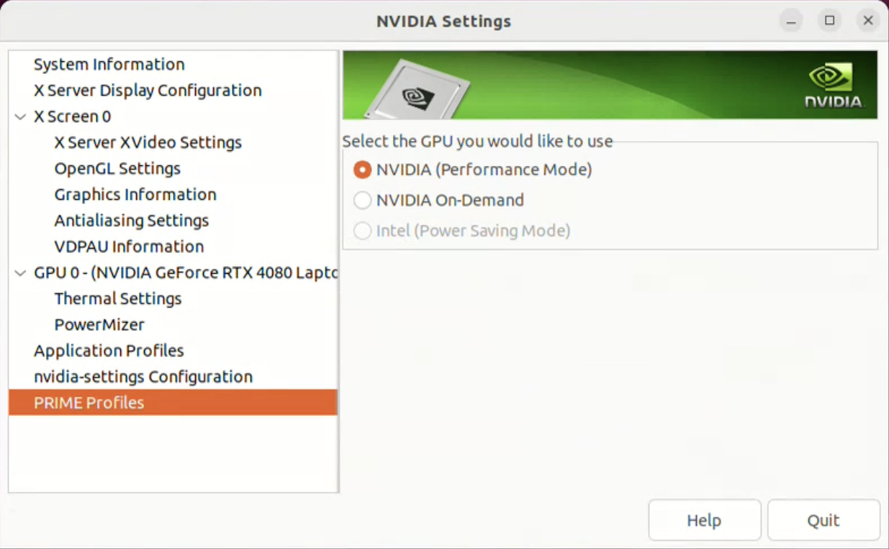

Simulation Environment Setup
============================

Competition Network Setup
-------------------------

Robot simulations are performed on a computer provided by the organizer.

 * `Organizer-provided computer specifications <https://www.amazon.co.jp/dp/B0BTM9SYSX?language=en_US>`_

Simulation results are obtained via network communication, and participants control their robots on their own computers. The organizer-provided computer functions as the server, while the competitor-provided computer functions as the client.
The robots are simulated on the organizer-provided computer and connected to the competitor-provided computer via a network. This relationship is similar to how a real mobile robot connects to a host computer via a network. If competitor wishs to use their own robots or features in the competition, they must submit their robot model and program to the organizer, who will then import them on the competition simulation computer.

**Do not use Wi-Fi communication while running a simulation. Using Wi-Fi communication will slow down the Choreonoid simulation.**

 * `Tutorial video: Network Setup <https://www.youtube.com/watch?v=xuybtku4VAU>`_
 * `Tutorial video: Maneuvering the robot via ROS2 <https://www.youtube.com/watch?v=8PlOL2M9Hno>`_

[MANDATORY] Graphics Card Configuration
---------------------------------------

To process Choreonoid with an Nvidia GPU, change the settings as follows:

 1. Select "Prime Profiles" in "NVIDIA settings".
 2. For "Select the GPU you would like to use", select "NVIDIA (Performance Mode)"
 3. When you launch Choreonoid, if "Driver Profile: NVIDIA Corporation XX" displays as shown below, Choreonoid will use the NVIDIA GPU.

**If you are running on a laptop, please run the Choreonoid simulation while it is connected to a power source. If it is not connected, the simulation will run slowly.**
